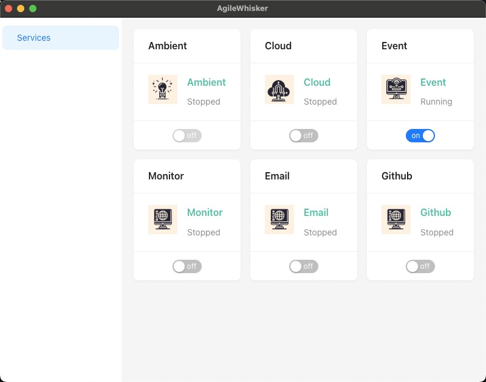
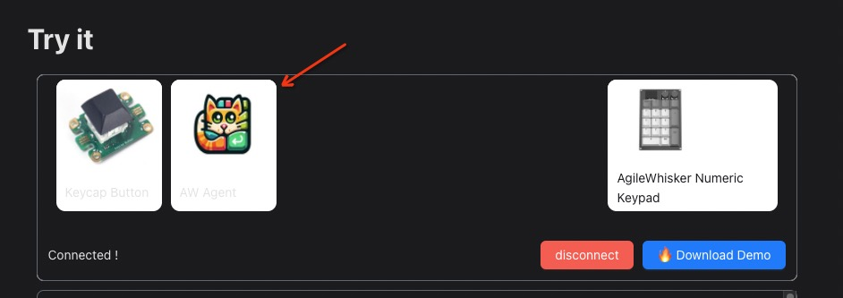

## Introduction

We also provide a host app for the AgileWhisker Keyboard. The host app is a desktop application that exposes the system abilities to jacdac devices. It is a bridge between the keyboard and the system. The host app is written in typescript and is open source. You can find the source code on [GitHub](https://github.com/kittenbot/agilewhisker-desktop)

## Features

- [x] System information, including CPU, memory, disk, network usage or temperature.
- [x] PC events, including open url, application launch, execute command, etc.
- [x] Build-in MQTT broker, you can use it as a cloud provider in device script.
- [x] Github api, you can use it to get the latest status of your repository.
- [ ] Screen capture and OCR, you can use it to get the text from the screen.

More features and ideas are welcome, please feel free to open an issue on GitHub.

## Usage

- Download the latest version of the host app from the [release page](https://github.com/kittenbot/agilewhisker-desktop) and install it.

- Start the host app, you will find a new icon in the system tray.

- Click the icon to open the host app window. You can toggle the service from the window.

- Any service you toggle on will be available in the device script. You will also find the host app in the available devices list.

